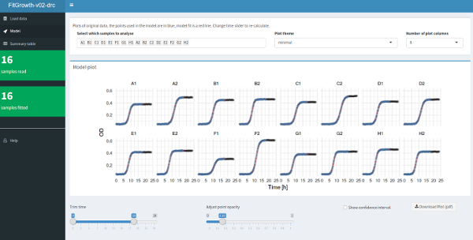
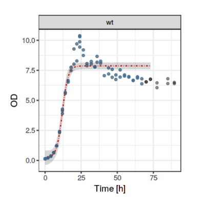

**FitGrowth**

Shiny app for modelling bacterial growth kinetics.
This app fits a four parameter log-logistic model to the growth data, using the `drc` package in `R`. More details about the `drc` library can be found [here](http://bioassay.dk/introductory-dose-response-with-drc/) or in [this paper](http://journals.plos.org/plosone/article?id=10.1371/journal.pone.0146021).

The app handles one or many samples (tested with 96), as well as NA values. 
You can use the example files in the `testdata` directory (growthdata16.txt and growthdata3.tab) to test the app and to see how the input files should be organized.


**Instructions:** 
The easiest way to run FitGrowth is if you have [RStudio](http://rstudio.org), you just have to paste this in your console:

```r
shiny::runGitHub("FitGrowth", "angelovangel", subdir = "v02-drc")

```


You will need these packages, so install them if you haven't done so: `shiny`, `shinydashboard`, `drc`, `tidyverse`, `data.table` and `DT`.
Upload the data as a text file, the first column **must** be named `time`, all other columns are treated as samples. After that, take a look at the other tabs. Note that the parameters of the model are re-calculated when the time interval is changed with the slider.





Cheers!   
Angel